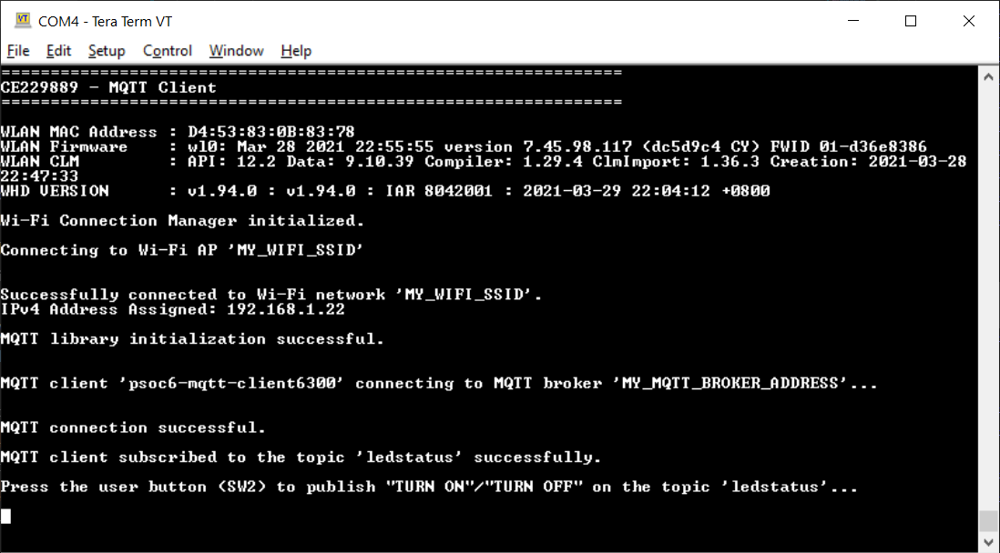
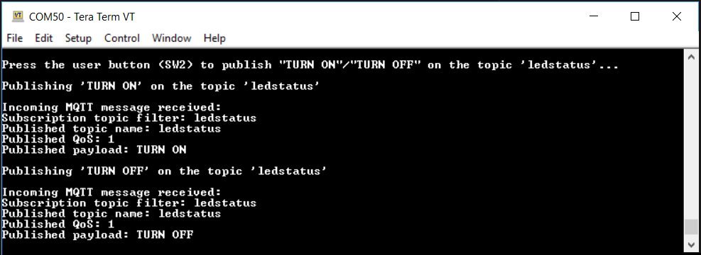

# AnyCloud Example: MQTT Client

This code example demonstrates implementing an MQTT Client using the [MQTT Client library](https://github.com/cypresssemiconductorco/mqtt) for Cypress connectivity devices. The library uses the AWS IoT Device SDK MQTT Client library that includes an MQTT 3.1.1 Client.

In this example, the MQTT Client RTOS task establishes a connection with the configured MQTT Broker, and creates two tasks - Publisher and Subscriber. The Publisher task publishes messages on a topic when the user button is pressed. The Subscriber task subscribes to the same topic and controls the user LED based on the messages received.


**Sequence of Operation**

1. The user button is pressed.

2. The GPIO interrupt service routine (ISR) notifies the Publisher task.

3. The Publisher task publishes a message on a topic.

4. The MQTT broker sends back the message to the MQTT Client because it is also subscribed to the same topic.

5. When the message is received, the Subscriber task turns the LED ON or OFF. As a result, the user LED toggles every time the user presses the button.

[Provide feedback on this Code Example.](https://cypress.co1.qualtrics.com/jfe/form/SV_1NTns53sK2yiljn?Q_EED=eyJVbmlxdWUgRG9jIElkIjoiQ0UyMjk4ODkiLCJTcGVjIE51bWJlciI6IjAwMi0yOTg4OSIsIkRvYyBUaXRsZSI6IkFueUNsb3VkIEV4YW1wbGU6IE1RVFQgQ2xpZW50IiwicmlkIjoic21yeCIsIkRvYyB2ZXJzaW9uIjoiMi4wLjAiLCJEb2MgTGFuZ3VhZ2UiOiJFbmdsaXNoIiwiRG9jIERpdmlzaW9uIjoiTUNEIiwiRG9jIEJVIjoiSUNXIiwiRG9jIEZhbWlseSI6IlBTT0MifQ==)


## Requirements

- [ModusToolbox® software](https://www.cypress.com/products/modustoolbox-software-environment) v2.2

    **Note:** This code example version requires ModusToolbox software version 2.2 or later and is not backward compatible with v2.1 or older versions. If you cannot move to ModusToolbox v2.2, use the latest compatible version of this example: [latest-v1.X](https://github.com/cypresssemiconductorco/mtb-example-anycloud-mqtt-client/tree/latest-v1.X).

- Board Support Package (BSP) minimum required version: 2.0.0
- Programming Language: C
- Associated Parts: All [PSoC® 6 MCU](http://www.cypress.com/PSoC6) parts with SDIO, CYW43012, CYW4343W


## Supported Toolchains (make variable 'TOOLCHAIN')

- GNU Arm® Embedded Compiler v9.3.1 (`GCC_ARM`) - Default value of `TOOLCHAIN`
- IAR C/C++ compiler v8.32.2 (`IAR`)


## Supported Kits (make variable 'TARGET')

- [PSoC 6 Wi-Fi BT Prototyping Kit](https://www.cypress.com/CY8CPROTO-062-4343W) (`CY8CPROTO-062-4343W`) - Default value of `TARGET`
- [PSoC 62S2 Wi-Fi BT Pioneer Kit](https://www.cypress.com/CY8CKIT-062S2-43012) (`CY8CKIT-062S2-43012`)

**Note:** This example requires PSoC 6 device with at least 2 MB flash and 1 MB SRAM and therefore does not support other PSoC 6 MCU kits.


## Hardware Setup

This example uses the board's default configuration. See the kit user guide to ensure that the board is configured correctly.


## Software Setup

Install a terminal emulator if you don't have one. Instructions in this document use [Tera Term](https://ttssh2.osdn.jp/index.html.en).

This example requires no additional software or tools.


## Using the Code Example

### In Eclipse IDE for ModusToolbox:

1. Click the **New Application** link in the **Quick Panel** (or, use **File** > **New** > **ModusToolbox Application**). This launches the [Project Creator](http://www.cypress.com/ModusToolboxProjectCreator) tool.

2. Pick a kit supported by the code example from the list shown in the **Project Creator - Choose Board Support Package (BSP)** dialog.

   When you select a supported kit, the example is reconfigured automatically to work with the kit. To work with a different supported kit later, use the [Library Manager](https://www.cypress.com/ModusToolboxLibraryManager) to choose the BSP for the supported kit. You can use the Library Manager to select or update the BSP and firmware libraries used in this application. To access the Library Manager, click the link from the **Quick Panel**.

   You can also just start the application creation process again and select a different kit.

   If you want to use the application for a kit not listed here, you may need to update the source files. If the kit does not have the required resources, the application may not work.

3. In the **Project Creator - Select Application** dialog, choose the example by enabling the checkbox.

4. Optionally, change the suggested **New Application Name**.

5. Enter the local path in the **Application(s) Root Path** field to indicate where the application needs to be created.

   Applications that can share libraries can be placed in the same root path.

6. Click **Create** to complete the application creation process.

For more details, see the [Eclipse IDE for ModusToolbox User Guide](https://www.cypress.com/MTBEclipseIDEUserGuide) (locally available at *{ModusToolbox install directory}/ide_{version}/docs/mt_ide_user_guide.pdf*).


### In Command-line Interface (CLI):

ModusToolbox provides the Project Creator as both a GUI tool and a command line tool to easily create one or more ModusToolbox applications. See the "Project Creator Tools" section of the [ModusToolbox User Guide](https://www.cypress.com/ModusToolboxUserGuide) for more details.

Alternatively, you can manually create the application using the following steps:

1. Download and unzip this repository onto your local machine, or clone the repository.

2. Open a CLI terminal and navigate to the application folder.

   On Linux and macOS, you can use any terminal application. On Windows, open the **modus-shell** app from the Start menu.

   **Note:** The cloned application contains a default BSP file (*TARGET_xxx.mtb*) in the *deps* folder. Use the [Library Manager](https://www.cypress.com/ModusToolboxLibraryManager) (`make modlibs` command) to select and download a different BSP file, if required. If the selected kit does not have the required resources or is not [supported](#supported-kits-make-variable-target), the application may not work.

3. Import the required libraries by executing the `make getlibs` command.

Various CLI tools include a `-h` option that prints help information to the terminal screen about that tool. For more details, see the [ModusToolbox User Guide](https://www.cypress.com/ModusToolboxUserGuide) (locally available at *{ModusToolbox install directory}/docs_{version}/mtb_user_guide.pdf*).


### In Third-party IDEs:

1. Follow the instructions from the [CLI](#in-command-line-interface-cli) section to create the application, and import the libraries using the `make getlibs` command.

2. Export the application to a supported IDE using the `make <ide>` command.

    For a list of supported IDEs and more details, see the "Exporting to IDEs" section of the [ModusToolbox User Guide](https://www.cypress.com/ModusToolboxUserGuide) (locally available at *{ModusToolbox install directory}/docs_{version}/mtb_user_guide.pdf*.

3. Follow the instructions displayed in the terminal to create or import the application as an IDE project.


## Operation

1. Connect the board to your PC using the provided USB cable through the KitProg3 USB connector.

2. Modify the user configuration files in the *configs* directory as follows:

      1. **Wi-Fi Configuration:** Set the Wi-Fi credentials in *configs/wifi_config.h*: Modify the macros `WIFI_SSID`, `WIFI_PASSWORD`, and `WIFI_SECURITY` to match with that of the Wi-Fi network that you want to connect.

      2. **MQTT Configuration:** Set up the MQTT Client and configure the credentials in *configs/mqtt_client_config.h* as follows:

         - **For AWS IoT MQTT:**

             1. Set up the MQTT device (also known as a *Thing*) in the AWS IoT Core as described in the [Getting Started with AWS IoT tutorial](https://docs.aws.amazon.com/iot/latest/developerguide/iot-gs.html).

                **Note:** While setting up your device, ensure that the policy associated with this device permits all MQTT operations (*iot:Connect*, *iot:Publish*, *iot:Receive*, and *iot:Subscribe*) for the resource used by this device. For testing purposes, it is recommended to have the following policy document which allows all *MQTT Policy Actions* on all *Amazon Resource Names (ARNs)*.
                ```
                {
                    "Version": "2012-10-17",
                    "Statement": [
                        {
                            "Effect": "Allow",
                            "Action": "iot:*",
                            "Resource": "*"
                        }
                    ]
                }
                ```

             2. Set `MQTT_BROKER_ADDRESS` to your custom endpoint on the Settings page of the AWS IoT Console. This has the format `ABCDEFG1234567.iot.<region>.amazonaws.com`.

             3. Download the following certificates and keys that are created and activated in the previous step:
                   - A certificate for the AWS IoT thing - *xxxxxxxxxx.cert.pem*
                   - A public key - *xxxxxxxxxx.public.key*
                   - A private key - *xxxxxxxxxx.private.key*
                   - Root CA "RSA 2048 bit key: Amazon Root CA 1" for AWS IoT from [CA Certificates for Server Authentication](https://docs.aws.amazon.com/iot/latest/developerguide/server-authentication.html#server-authentication-certs).

             4. Using these certificates and keys, enter the following parameters in *mqtt_client_config.h* in Privacy-Enhanced Mail (PEM) format:
                   - `CLIENT_CERTIFICATE` - *xxxxxxxxxx.cert.pem*
                   - `CLIENT_PRIVATE_KEY` - *xxxxxxxxxx.private.key*
                   - `ROOT_CA_CERTIFICATE` - Root CA certificate

                You can either convert the values to strings manually following the format shown in *mqtt_client_config.h* or you can use the HTML utility available [here](https://github.com/cypresssemiconductorco/amazon-freertos/blob/master/tools/certificate_configuration/PEMfileToCString.html) to convert the certificates and keys from PEM format to C string format. You need to clone the repository from GitHub to use the utility.

         - **For public Mosquitto Broker:**

           **Note:** The public test MQTT Broker at [test.mosquitto.org](https://test.mosquitto.org/) uses the SHA-1 hashing algorithm for certificate signing. As cautioned by Mbed TLS, SHA-1 is considered a weak message digest. The use of SHA-1 for certificate signing constitutes a security risk. It is recommended to avoid dependencies on it, and consider stronger message digests instead.

           Note that this code example enables SHA-1 support in Mbed TLS and MQTT Client libraries in order to support secure TLS-based connections to the public test MQTT Broker as described [here](https://github.com/cypresssemiconductorco/mqtt/tree/latest-v2.X#quick-start).

             1. Set `MQTT_BROKER_ADDRESS` as `"test.mosquitto.org"`.

             2. Set `AWS_IOT_MQTT_MODE` to `0` as you are connecting to an MQTT Broker other than AWS IoT.

             3. For a *secure connection* that requires client authentication using TLS (port 8884), configure as follows:

                   - `MQTT_PORT` as `8884`.
                   - `MQTT_SECURE_CONNECTION` as `1`.
                   - Generate the client certificate and the private key according to the instructions from [test.mosquitto.org](https://test.mosquitto.org/). The root CA certificate is available [here](https://test.mosquitto.org/ssl/mosquitto.org.crt).

                     Using the client certificate, private key, and root CA certificate, configure the `CLIENT_CERTIFICATE`, `CLIENT_PRIVATE_KEY`, and `ROOT_CA_CERTIFICATE` macros respectively.

                     You can either convert the PEM format values to strings manually following the format shown in *mqtt_client_config.h* or you can use the HTML utility available [here](https://github.com/cypresssemiconductorco/amazon-freertos/blob/master/tools/certificate_configuration/PEMfileToCString.html) to convert the certificates and keys from PEM format to C string format. You need to clone the repository from GitHub to use the utility.
                   - In the application *Makefile*, set the variable `ENABLE_SECURE_MOSQUITTO_BROKER_SUPPORT` as `1` to enable SHA-1 support.

                For *non-TLS connections* (port 1883), configure the macros as follows:

                   - `MQTT_PORT` as `1883`.
                   - `MQTT_SECURE_CONNECTION` as `0`.

         - **Other MQTT Client configuration macros:**

             1. `MQTT_TOPIC`: The MQTT topic common to both the Publisher and Subscriber in this example.
             2. `ENABLE_LWT_MESSAGE`: Set to `1` to use MQTT's Last Will and Testament (LWT) feature. This is an MQTT message that will be published by the MQTT Broker if the MQTT connection is unexpectedly closed.
             3. `GENERATE_UNIQUE_CLIENT_ID`: Every active MQTT connection must have a unique client identifier. If this macro is set to `1`, the device will generate a unique client identifier by appending a timestamp to the string specified by the `MQTT_CLIENT_IDENTIFIER` macro. This feature is useful if you are using the same code on multiple kits simultaneously.

         Although this code example provides instructions only for AWS IoT and public test Mosquitto Broker, the MQTT Client implemented in this example is generic. It is expected to work with other MQTT Brokers (see the [list of publicly-accessible MQTT Brokers](https://github.com/mqtt/mqtt.github.io/wiki/public_brokers)) with appropriate configurations.

      3. Other configuration files: You can optionally modify the configuration macros in the following files according to your application:
         - *configs/iot_config.h* used by the [MQTT library](https://github.com/cypresssemiconductorco/mqtt)
         - *configs/FreeRTOSConfig.h* used by the [FreeRTOS library](https://github.com/cypresssemiconductorco/freertos)

3. Open a terminal program and select the KitProg3 COM port. Set the serial port parameters to 8N1 and 115200 baud.

4. Program the board.

   - **Using Eclipse IDE for ModusToolbox:**

      1. Select the application project in the Project Explorer.

      2. In the **Quick Panel**, scroll down, and click **\<Application Name> Program (KitProg3_MiniProg4)**.

   - **Using CLI:**

     From the terminal, execute the `make program` command to build and program the application using the default toolchain to the default target. You can specify a target and toolchain manually:
      ```
      make program TARGET=<BSP> TOOLCHAIN=<toolchain>
      ```

      Example:
      ```
      make program TARGET=CY8CKIT-062S2-43012 TOOLCHAIN=GCC_ARM
      ```

   After programming, the application starts automatically. Observe the messages on the UART terminal, and wait for the device to make all the required connections.

   **Figure 1. UART Terminal Showing the Application Initialization Status**

   

5. Once the initialization is complete, confirm that the message *"Press the user button (SW2) to publish "TURN ON"/"TURN OFF" on the topic 'ledstatus'..."* is printed on the UART terminal. This message may vary depending on the MQTT topic and publish messages that are configured in the *mqtt_client_config.h* file.

6. Press the user button (SW2) on the kit to toggle the LED state.

7. Confirm that the user LED state is toggled and the messages received on the subscribed topic are printed on the UART terminal.

   **Figure 2. Messages Received on the Subscribed Topic**

   

This example can be programmed on multiple kits (*Only when `GENERATE_UNIQUE_CLIENT_ID` is set to `1`*); the user LEDs on all the kits will synchronously toggle with button presses on any kit.

Alternatively, the publish and subscribe functionalities of the MQTT Client can be individually verified if the MQTT Broker supports a Test MQTT Client like the AWS IoT.

- *To verify the subscribe functionality*: Using the Test MQTT Client, publish messages such as "TURN ON" and "TURN OFF" on the topic specified by the `MQTT_TOPIC` macro in *mqtt_client_config.h* to control the LED state on the kit.

- *To verify the publish functionality*: From the Test MQTT Client, subscribe to the MQTT topic specified by the `MQTT_TOPIC` macro and confirm that the messages published by the kit are displayed on the Test MQTT Client's console.


## Debugging

You can debug the example to step through the code. In the IDE, use the **\<Application Name> Debug (KitProg3_MiniProg4)** configuration in the **Quick Panel**. For more details, see the "Program and Debug" section in the [Eclipse IDE for ModusToolbox User Guide](https://www.cypress.com/MTBEclipseIDEUserGuide).

**Note:** **(Only while debugging)** On the CM4 CPU, some code in `main()` may execute before the debugger halts at the beginning of `main()`. This means that some code executes twice - once before the debugger stops execution, and again after the debugger resets the program counter to the beginning of `main()`. See [KBA231071](https://community.cypress.com/docs/DOC-21143) to learn about this and for the workaround.

## Design and Implementation

This example implements three RTOS tasks: MQTT Client, Publisher, and Subscriber. The main function initializes the BSP and the retarget-io library, and creates the MQTT Client task.

The MQTT Client task initializes the Wi-Fi Connection Manager (WCM) and connects to a Wi-Fi access point (AP) using the Wi-Fi network credentials that are configured in *wifi_config.h*. Upon a successful Wi-Fi connection, the task initializes the MQTT library and establishes a connection with the MQTT Broker/Server.

The MQTT connection is configured to be secure by default; the secure connection requires a client certificate, a private key, and the Root CA certificate of the MQTT Broker that are configured in *mqtt_client_config.h*.

After a successful MQTT connection, the Subscriber and Publisher tasks are created. The MQTT Client task then waits for messages from the other two tasks and callbacks, and handles the cleanup operations of various libraries if the messages indicate failure.

The Subscriber task initializes the user LED GPIO and subscribes to messages on the topic specified by the `MQTT_TOPIC` macro that can be configured in *mqtt_client_config.h*. When the subscribe operation fails, a message is sent to the MQTT Client task over a message queue. When the Subscriber task receives a message from the Broker, it turns the user LED ON or OFF depending on whether the received message is "TURN ON" or "TURN OFF".

The Publisher task sets up the user button GPIO and configures an interrupt for the button. The ISR notifies the Publisher task upon a button press. The Publisher task then publishes messages (*TURN ON* / *TURN OFF*) on the topic specified by the `MQTT_TOPIC` macro. When the publish operation fails, a message is sent over a queue to the MQTT Client task.

When a failure has been encountered, the MQTT Client task handles the cleanup operations of various libraries, thereby terminating any existing MQTT and Wi-Fi connections and deleting the MQTT, Publisher and Subscriber tasks.

**Note:** The CY8CPROTO-062-4343W board shares the same GPIO for the user button (USER BTN) and the CYW4343W host wakeup pin. Because this example uses the GPIO for interfacing with the user button to toggle the LED, the SDIO interrupt to wake up the host is disabled by setting `CY_WIFI_HOST_WAKE_SW_FORCE` to '0' in the Makefile through the `DEFINES` variable.


### Resources and Settings

**Table 1. Application Resources**

| Resource  |  Alias/Object     |    Purpose     |
| :------- | :------------    | :------------ |
| UART (HAL)|cy_retarget_io_uart_obj| UART HAL object used by Retarget-IO for Debug UART port  |
| GPIO (HAL)    | CYBSP_USER_LED         | User LED controlled by the Subscriber based on incoming MQTT messages  |
| GPIO (HAL)    | CYBSP_USER_BTN         | User Button used to notify the Publisher to publish MQTT messages |


## Related Resources

| Application Notes                                            |                                                              |
| :----------------------------------------------------------- | :----------------------------------------------------------- |
| [AN228571](https://www.cypress.com/AN228571) – Getting Started with PSoC 6 MCU on ModusToolbox | Describes PSoC 6 MCU devices and how to build your first application with ModusToolbox |
| [AN221774](https://www.cypress.com/AN221774) – Getting Started with PSoC 6 MCU on PSoC Creator | Describes PSoC 6 MCU devices and how to build your first application with PSoC Creator |
| [AN210781](https://www.cypress.com/AN210781) – Getting Started with PSoC 6 MCU with Bluetooth Low Energy (BLE) Connectivity on PSoC Creator | Describes PSoC 6 MCU with BLE Connectivity devices and how to build your first application with PSoC Creator |
| [AN215656](https://www.cypress.com/AN215656) – PSoC 6 MCU: Dual-CPU System Design | Describes the dual-CPU architecture in PSoC 6 MCU, and shows how to build a simple dual-CPU design |
| **Code Examples**                                            |                                                              |
| [Using ModusToolbox](https://github.com/cypresssemiconductorco/Code-Examples-for-ModusToolbox-Software) | [Using PSoC Creator](https://www.cypress.com/documentation/code-examples/psoc-6-mcu-code-examples) |
| **Device Documentation**                                     |                                                              |
| [PSoC 6 MCU Datasheets](https://www.cypress.com/search/all?f[0]=meta_type%3Atechnical_documents&f[1]=resource_meta_type%3A575&f[2]=field_related_products%3A114026) | [PSoC 6 Technical Reference Manuals](https://www.cypress.com/search/all/PSoC%206%20Technical%20Reference%20Manual?f[0]=meta_type%3Atechnical_documents&f[1]=resource_meta_type%3A583) |
| **Development Kits**                                         | Buy at www.cypress.com                                       |
| [CY8CKIT-062-BLE](https://www.cypress.com/CY8CKIT-062-BLE) PSoC 6 BLE Pioneer Kit | [CY8CKIT-062-WiFi-BT](https://www.cypress.com/CY8CKIT-062-WiFi-BT) PSoC 6 WiFi-BT Pioneer Kit |
| [CY8CPROTO-063-BLE](https://www.cypress.com/CY8CPROTO-063-BLE) PSoC 6 BLE Prototyping Kit | [CY8CPROTO-062-4343W](https://www.cypress.com/CY8CPROTO-062-4343W) PSoC 6 Wi-Fi BT Prototyping Kit |
| [CY8CKIT-062S2-43012](https://www.cypress.com/CY8CKIT-062S2-43012) PSoC 62S2 Wi-Fi BT Pioneer Kit | [CY8CPROTO-062S3-4343W](https://www.cypress.com/CY8CPROTO-062S3-4343W) PSoC 62S3 Wi-Fi BT Prototyping Kit |
| [CYW9P62S1-43438EVB-01](https://www.cypress.com/CYW9P62S1-43438EVB-01) PSoC 62S1 Wi-Fi BT Pioneer Kit | [CYW9P62S1-43012EVB-01](https://www.cypress.com/CYW9P62S1-43012EVB-01) PSoC 62S1 Wi-Fi BT Pioneer Kit |
| [CY8CKIT-064B0S2-4343W](http://www.cypress.com/CY8CKIT-064B0S2-4343W) PSoC 64 Secure Boot Wi-Fi BT Pioneer Kit |
| **Libraries**                                                |                                                              |
| PSoC 6 Peripheral Driver Library (PDL) and docs  | [mtb-pdl-cat1](https://github.com/cypresssemiconductorco/mtb-pdl-cat1) on GitHub |
| Cypress Hardware Abstraction Layer (HAL) Library and docs    | [mtb-hal-cat1](https://github.com/cypresssemiconductorco/mtb-hal-cat1) on GitHub |
| Retarget IO - A utility library to retarget the standard input/output (STDIO) messages to a UART port | [retarget-io](https://github.com/cypresssemiconductorco/retarget-io) on GitHub |
| **Middleware**                                               |                                                              |
| MQTT Client library and docs                                      | [mqtt](https://github.com/cypresssemiconductorco/mqtt) on GitHub |
| Wi-Fi Connection Manager (WCM) library and docs                   | [wifi-connection-manager](https://github.com/cypresssemiconductorco/wifi-connection-manager) on GitHub |
| Wi-Fi Middleware Core library and docs                            | [wifi-mw-core](https://github.com/cypresssemiconductorco/wifi-mw-core) on GitHub|
| FreeRTOS library and docs                                    | [freeRTOS](https://github.com/cypresssemiconductorco/freertos) on GitHub |
| CapSense® library and docs                                   | [capsense](https://github.com/cypresssemiconductorco/capsense) on GitHub |
| Links to all PSoC 6 MCU Middleware                           | [psoc6-middleware](https://github.com/cypresssemiconductorco/psoc6-middleware) on GitHub |
| **Tools**                                                    |                                                              |
| [Eclipse IDE for ModusToolbox](https://www.cypress.com/modustoolbox) | The cross-platform, Eclipse-based IDE for IoT designers that supports application configuration and development targeting converged MCU and wireless systems. |
| [PSoC Creator™](https://www.cypress.com/products/psoc-creator-integrated-design-environment-ide) | The Cypress IDE for PSoC and FM0+ MCU development. |

## Other Resources

Cypress provides a wealth of data at www.cypress.com to help you select the right device, and quickly and effectively integrate it into your design.

For PSoC 6 MCU devices, see [How to Design with PSoC 6 MCU - KBA223067](https://community.cypress.com/docs/DOC-14644) in the Cypress community.

## Document History

Document Title: *CE229889* - *AnyCloud Example: MQTT Client*

| Version | Description of Change |
| ------- | --------------------- |
| 1.0.0   | New code example.      |
| 1.1.0   | Minor bug fixes and Makefile updates to sync with BSP changes. |
| 2.0.0   | Major update to support ModusToolbox software v2.2, added support for Mosquitto Broker.<br /> This version is not backward compatible with ModusToolbox software v2.1.  |
------

All other trademarks or registered trademarks referenced herein are the property of their respective owners.


-------------------------------------------------------------------------------

© Cypress Semiconductor Corporation, 2020-2021. This document is the property of Cypress Semiconductor Corporation and its subsidiaries ("Cypress"). This document, including any software or firmware included or referenced in this document ("Software"), is owned by Cypress under the intellectual property laws and treaties of the United States and other countries worldwide. Cypress reserves all rights under such laws and treaties and does not, except as specifically stated in this paragraph, grant any license under its patents, copyrights, trademarks, or other intellectual property rights. If the Software is not accompanied by a license agreement and you do not otherwise have a written agreement with Cypress governing the use of the Software, then Cypress hereby grants you a personal, non-exclusive, nontransferable license (without the right to sublicense) (1) under its copyright rights in the Software (a) for Software provided in source code form, to modify and reproduce the Software solely for use with Cypress hardware products, only internally within your organization, and (b) to distribute the Software in binary code form externally to end users (either directly or indirectly through resellers and distributors), solely for use on Cypress hardware product units, and (2) under those claims of Cypress's patents that are infringed by the Software (as provided by Cypress, unmodified) to make, use, distribute, and import the Software solely for use with Cypress hardware products. Any other use, reproduction, modification, translation, or compilation of the Software is prohibited.<br />
TO THE EXTENT PERMITTED BY APPLICABLE LAW, CYPRESS MAKES NO WARRANTY OF ANY KIND, EXPRESS OR IMPLIED, WITH REGARD TO THIS DOCUMENT OR ANY SOFTWARE OR ACCOMPANYING HARDWARE, INCLUDING, BUT NOT LIMITED TO, THE IMPLIED WARRANTIES OF MERCHANTABILITY AND FITNESS FOR A PARTICULAR PURPOSE. No computing device can be absolutely secure. Therefore, despite security measures implemented in Cypress hardware or software products, Cypress shall have no liability arising out of any security breach, such as unauthorized access to or use of a Cypress product. CYPRESS DOES NOT REPRESENT, WARRANT, OR GUARANTEE THAT CYPRESS PRODUCTS, OR SYSTEMS CREATED USING CYPRESS PRODUCTS, WILL BE FREE FROM CORRUPTION, ATTACK, VIRUSES, INTERFERENCE, HACKING, DATA LOSS OR THEFT, OR OTHER SECURITY INTRUSION (collectively, "Security Breach"). Cypress disclaims any liability relating to any Security Breach, and you shall and hereby do release Cypress from any claim, damage, or other liability arising from any Security Breach. In addition, the products described in these materials may contain design defects or errors known as errata which may cause the product to deviate from published specifications. To the extent permitted by applicable law, Cypress reserves the right to make changes to this document without further notice. Cypress does not assume any liability arising out of the application or use of any product or circuit described in this document. Any information provided in this document, including any sample design information or programming code, is provided only for reference purposes. It is the responsibility of the user of this document to properly design, program, and test the functionality and safety of any application made of this information and any resulting product. "High-Risk Device" means any device or system whose failure could cause personal injury, death, or property damage. Examples of High-Risk Devices are weapons, nuclear installations, surgical implants, and other medical devices. "Critical Component" means any component of a High-Risk Device whose failure to perform can be reasonably expected to cause, directly or indirectly, the failure of the High-Risk Device, or to affect its safety or effectiveness. Cypress is not liable, in whole or in part, and you shall and hereby do release Cypress from any claim, damage, or other liability arising from any use of a Cypress product as a Critical Component in a High-Risk Device. You shall indemnify and hold Cypress, its directors, officers, employees, agents, affiliates, distributors, and assigns harmless from and against all claims, costs, damages, and expenses, arising out of any claim, including claims for product liability, personal injury or death, or property damage arising from any use of a Cypress product as a Critical Component in a High-Risk Device. Cypress products are not intended or authorized for use as a Critical Component in any High-Risk Device except to the limited extent that (i) Cypress's published data sheet for the product explicitly states Cypress has qualified the product for use in a specific High-Risk Device, or (ii) Cypress has given you advance written authorization to use the product as a Critical Component in the specific High-Risk Device and you have signed a separate indemnification agreement.<br />
Cypress, the Cypress logo, Spansion, the Spansion logo, and combinations thereof, WICED, PSoC, CapSense, EZ-USB, F-RAM, and Traveo are trademarks or registered trademarks of Cypress in the United States and other countries. For a more complete list of Cypress trademarks, visit cypress.com. Other names and brands may be claimed as property of their respective owners.
